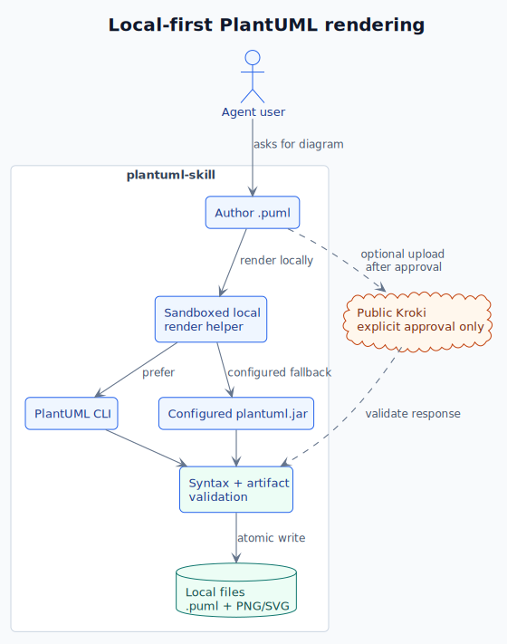

# plantuml-skill

Codex skill for generating PlantUML diagrams and rendering them to PNG/SVG with
host-installed PlantUML dependencies. Public rendering is available only after
explicit approval.

## Quick Install

Copy the text below into your local agent. The agent should detect whether it is
running as Codex, Claude Code, or OpenCode, then install the skill into the
right discovery directory.

Agent-side install prerequisites:

- Authenticated GitHub access to the private `DoubleMice/plantuml-skill` repo.
- Codex: `python3` and the built-in Codex skill installer, usually at
  `${CODEX_HOME:-$HOME/.codex}/skills/.system/skill-installer/scripts/install-skill-from-github.py`.
- Claude Code and OpenCode: a working GitHub auth path such as `gh`, `git`, or
  another authenticated downloader, plus write access to the target skills
  directory.
- For rendering diagrams after installation: host `plantuml` and Graphviz
  (`dot`). Installing the skill itself does not install renderer dependencies.

Agents should not overwrite an existing `plantuml-skill` directory unless you
explicitly ask them to replace it.

Copy below text into your local agent to install:

```text
Install the PlantUML Agent Skill from the private GitHub repo https://github.com/DoubleMice/plantuml-skill into the correct local skills directory for the agent you are running in.

Detect the current agent/runtime:
- If you are Codex, install repo path "." as skill name "plantuml-skill" into ${CODEX_HOME:-$HOME/.codex}/skills/plantuml-skill. Prefer the built-in Codex skill installer at ${CODEX_HOME:-$HOME/.codex}/skills/.system/skill-installer/scripts/install-skill-from-github.py when available.
- If you are Claude Code, install into ~/.claude/skills/plantuml-skill by default. If I explicitly ask for project-local install, use .claude/skills/plantuml-skill instead.
- If you are OpenCode, install into ~/.config/opencode/skills/plantuml-skill by default. If I explicitly ask for project-local install, use .opencode/skills/plantuml-skill instead.
- If you cannot confidently detect the current agent/runtime, ask me which target to use before making changes.

Use my existing GitHub authentication for the private repo. You may use gh, git, the Codex skill installer, or another authenticated download method. The installed directory must contain SKILL.md directly at the target directory root, not nested under an archive wrapper directory.

Do not overwrite an existing plantuml-skill directory. If it already exists, stop and tell me. After installation, verify that SKILL.md exists at the installed path, run any available skill validation for the current agent, report the final path, and tell me whether the current agent needs a restart or reload to discover the skill.
```

OpenCode also discovers Claude-compatible skill installs under
`~/.claude/skills`, so one Claude Code install can be shared by both tools when
that is the desired setup. It also supports agent-compatible installs under
`~/.agents/skills` and `.agents/skills`.

## Agent Support

| Agent | Global install path | Project-local install path | Invocation |
|---|---|---|---|
| Codex | `${CODEX_HOME:-$HOME/.codex}/skills/plantuml-skill` | N/A | Automatic skill selection |
| Claude Code | `~/.claude/skills/plantuml-skill` | `.claude/skills/plantuml-skill` | Automatic or `/plantuml-skill` |
| OpenCode | `~/.config/opencode/skills/plantuml-skill` | `.opencode/skills/plantuml-skill` | Via OpenCode's native `skill` tool |

The same `SKILL.md` is used for all three agents. Its frontmatter intentionally
keeps only `name` and `description` for maximum compatibility; source, license,
and dependency details live in this README and in the skill body.

Official references:

- Claude Code skills: https://code.claude.com/docs/en/skills
- OpenCode agent skills: https://opencode.ai/docs/skills/

## Generated Diagram

The PlantUML source for this diagram is tracked at
[`assets/plantuml-skill-flow.puml`](assets/plantuml-skill-flow.puml).



## Origin

This repository is derived from the upstream skill:

- Original repository: https://github.com/Agents365-ai/plantuml-skill
- Original skill path: `skills/plantuml-skill`
- Local purpose: keep the PlantUML workflow, make host rendering the default,
  and avoid Docker/container dependencies for security-sensitive engineering
  work.

The upstream project declares MIT licensing in its skill metadata.

## Local changes

- Prefer host-installed `plantuml` plus Graphviz.
- Fall back to a host `plantuml.jar` when Java, Graphviz, and the jar are
  available.
- Generate only `.puml` source when no host renderer is available.
- Require explicit user approval before sending `.puml` source to public
  `https://kroki.io`.
- Report which renderer was used and whether the diagram source left the
  machine.

## Dependencies

Installing the skill copies instruction files only. It does not install Java,
Graphviz, `plantuml`, or `plantuml.jar`.

Dependency by task:

- Generate `.puml`: no external runtime dependency.
- Render via host PlantUML CLI: `plantuml` and Graphviz (`dot`) installed on
  the host.
- Render via host PlantUML jar: Java, Graphviz (`dot`), and `plantuml.jar`.
- Render via public Kroki: `curl` plus explicit user approval because the source
  is uploaded to a third-party service.

Install host dependencies:

```bash
# macOS
brew install plantuml graphviz

# Ubuntu / Debian
sudo apt-get update
sudo apt-get install -y plantuml graphviz
```

Verify host dependencies:

```bash
plantuml -version
dot -V
```

Render locally:

```bash
plantuml -tpng diagram.puml
plantuml -tsvg diagram.puml
```

Manual jar fallback:

```bash
PLANTUML_JAR=/path/to/plantuml.jar
java -jar "$PLANTUML_JAR" -tpng diagram.puml
```

## Validation

Validate the skill metadata with:

```bash
python3 /Users/doublemice/.codex/skills/.system/skill-creator/scripts/quick_validate.py /Users/doublemice/.codex/skills/plantuml-skill
```

Codex may need to be restarted before updated skill metadata is picked up.
