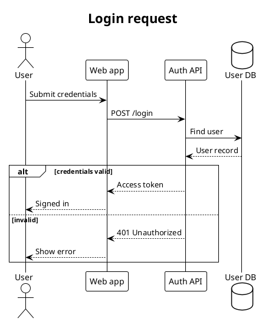
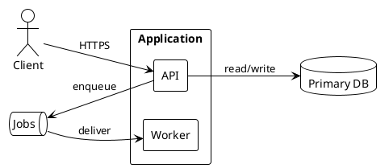
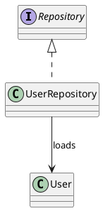
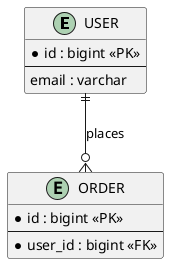
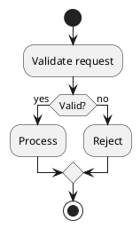
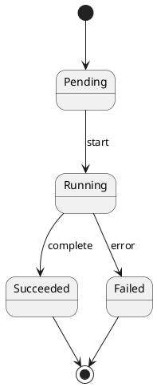
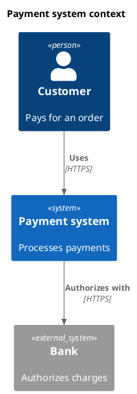

# PlantUML authoring guide

Use this reference when creating or refining `.puml` source. Start with the
smallest relevant template and add detail only when it improves the answer.

## Contents

- [Portable defaults](#portable-defaults)
- [Visual defaults](#visual-defaults)
- [Layout heuristics](#layout-heuristics)
- [Sequence](#sequence)
- [Component and architecture](#component-and-architecture)
- [Class and ER](#class-and-er)
- [Activity and state](#activity-and-state)
- [C4](#c4)
- [Other diagram types](#other-diagram-types)

## Portable defaults

Use a self-contained file and one diagram per file:

- Keep identifiers ASCII and stable; put user-facing text in quoted labels.
- Match the user's language and avoid unexplained abbreviations.
- Avoid `FontName` unless the destination environment guarantees the font.
- Avoid remote `!includeurl`, sprites, and icon packs. Prefer basic shapes.
- Treat colors as secondary encoding. Preserve readable contrast and add labels.
- Use `\n` to wrap long labels deliberately.

## Visual defaults

Read [`style-guide.md`](style-guide.md) for the shared base style, semantic
palette, diagram-specific profiles, typography, spacing, and visual-QA rules.
Apply it to new diagrams unless the user, repository, or surrounding document
already defines a style. The syntax examples below emphasize semantics and omit
the repeated style block for readability.

## Layout heuristics

- Use `left to right direction` for pipelines and layered architecture; use
  `top to bottom direction` for hierarchies and long labels.
- Declare elements in the intended reading order before adding directional arrow
  hints such as `-right->` or `-down->`.
- Group related elements with `package`, `rectangle`, or `together { }`.
- Use hidden edges only as a last layout hint: `A -[hidden]-> B`.
- Split a view when it has roughly more than 12 primary nodes, 20 relationships,
  several abstraction levels, or labels that need paragraph-length text.

## Sequence

Use for a single time-ordered scenario. Declare participants explicitly and
show important alternatives; omit implementation calls that do not affect the
reader's understanding.

Useful constructs: `alt`/`else`/`end`, `opt`, `loop`, `par`, `activate`, and
`deactivate`. Use `->` for calls, `-->` for responses, and `->>` for asynchronous
messages only when that distinction is factual.

## Component and architecture

Use for modules, services, storage, queues, and trust or deployment boundaries.

Common shapes: `actor`, `component`, `rectangle`, `package`, `node`, `database`,
`queue`, and `cloud`. Label edges with protocol, data, or intent when known.

## Class and ER

Use class diagrams for type semantics:

Relationship meanings:

| Syntax | Meaning |
|---|---|
| `Base <|-- Child` | inheritance |
| `Interface <|.. Impl` | realization |
| `Whole *-- Part` | composition/lifecycle ownership |
| `Whole o-- Part` | aggregation |
| `A --> B` | directed association or dependency |

Do not infer composition merely because one type references another.

Use ER diagrams only when keys and cardinalities are supported by a schema or
model definition:

## Activity and state

Use activity diagrams for procedures and decisions:

Use state diagrams for allowed lifecycle transitions:

Do not turn a procedural flow into a state diagram unless states persist and
transitions are meaningful domain events.

## C4

Use one C4 level per diagram. A local PlantUML distribution may provide the C4
standard library:

Use `<C4/C4_Container>` or `<C4/C4_Component>` for lower levels. If the local
renderer lacks C4, translate the same semantics into plain PlantUML components;
do not fetch a remote include without explicit approval.

## Other diagram types

| Type | Wrapper or key syntax | Use for |
|---|---|---|
| Use case | `actor`, `usecase` | actors and user-visible capabilities |
| Deployment | `node`, `artifact`, `database` | runtime placement and infrastructure |
| Mind map | `@startmindmap` / `@endmindmap` | concept hierarchy |
| Gantt | `@startgantt` / `@endgantt` | dated tasks and dependencies |

Consult local PlantUML help or official syntax documentation only when a feature
is version-specific. Keep the generated source compatible with the renderer
actually used for the task.
