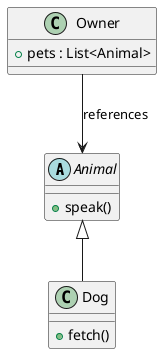

# Generate diagrams from source code

Use this playbook when the user asks for a diagram of a repository, module,
request path, schema, or model. Base the result on the current checkout and
state clearly when a relation is inferred rather than directly observed.

## Map evidence to a diagram

| Evidence | Diagram | PlantUML mapping |
|---|---|---|
| Classes, structs, interfaces | Class | types to `class`/`interface`; declared inheritance or realization to relation arrows |
| One handler, request, or event path | Sequence | callers and callees to participants; observed calls to messages |
| Modules, packages, imports, service wiring | Component | modules to components/packages; dependencies to labeled edges |
| ORM models, migrations, SQL DDL | ER | tables to entities; columns and keys to attributes; declared FKs to cardinalities |
| Status values plus transition logic | State | persistent statuses to states; allowed transitions to labeled edges |
| Runtime manifests and deployment config | Deployment | processes, nodes, stores, and network boundaries to deployment elements |

## Evidence workflow

1. Check the current branch, dirty worktree, and relevant generated/vendor
   boundaries before interpreting the repository.
2. Locate authoritative files with search tools. Read definitions, construction
   or wiring, call sites, configuration, and tests needed to establish each
   important relation; do not infer architecture from filenames alone.
3. Write a compact evidence ledger before drawing: element, relation, source
   file, and whether it is direct or inferred.
4. Pick one audience and abstraction level. Scope a large repository to one
   subsystem or emit an overview plus separate detail diagrams.
5. Preserve real identifiers where they aid traceability, while shortening
   signatures and labels that do not change the model.
6. Author, render, and visually inspect the diagram through the main workflow.
7. Re-open the cited code after drafting and check that every arrow, cardinality,
   transition, and boundary is defensible.

## Accuracy rules

- A static call graph proves possible calls, not runtime order. Mark optional or
  inferred sequence messages and do not invent returns.
- An import proves a dependency, not necessarily a network call.
- A field reference does not by itself prove composition or lifecycle ownership.
- ORM relationships may differ from physical foreign keys. Prefer migrations or
  DDL for database cardinality when available.
- Tests and mocks can reveal intended behavior but may not prove production
  wiring. Separate them visually or omit them from a production view.
- Exclude vendored, generated, fixture, and build-output code by default unless
  the user asks for it.

## Minimal class example

Given:

```python
class Animal:
    def speak(self): ...

class Dog(Animal):
    def fetch(self): ...

class Owner:
    def __init__(self):
        self.pets: list[Animal] = []
```

Render only supported semantics:



Do not upgrade `Owner --> Animal` to composition without lifecycle evidence.
